# SEG3503 Lab 02

| Outline | Value |
| --- | --- |
| Course | SEG 3503 |
| Date | Summer 2026 |
| Name | Mai Anh Hoang |
| Professor | Dr. Mouhcine Guennoun |
| TA | Mohamed Nefsi |

## Exercice 1

| Cas de test | Résultats escomptés | Résultats actuels | Verdict |
| --- | --- | --- | --- |
| 1 | Accepted | All fields are valid, application is accepted. 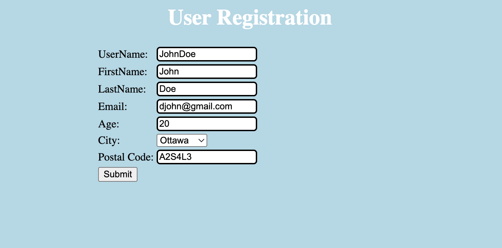 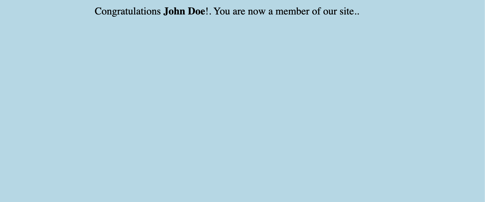 | Success |
| 2 | Wrong UserName format | UserName has a special character (@) => Wrong UserName format error message is displayed. 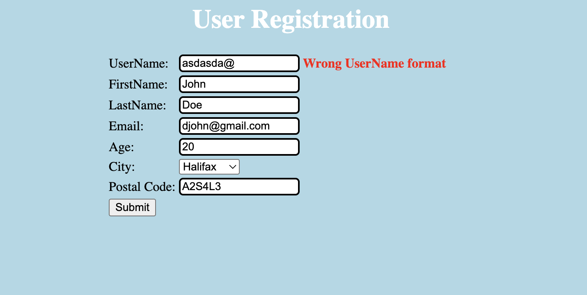 | Success |
| 3 | Size of UserName must be between 6 and 12 | Size of UserName = 4 => Size of UserName must be between 6 and 12 error message is displayed. 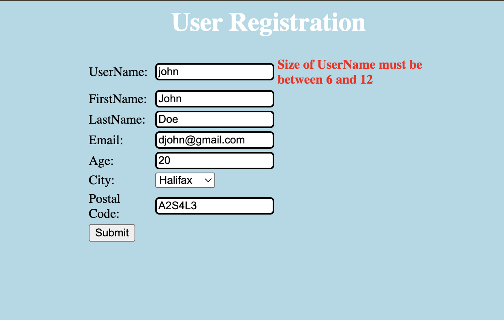 | Success |
| 4 | Wrong FirstName format | FirstName has numbers => Wrong FirstName format error message is displayed. 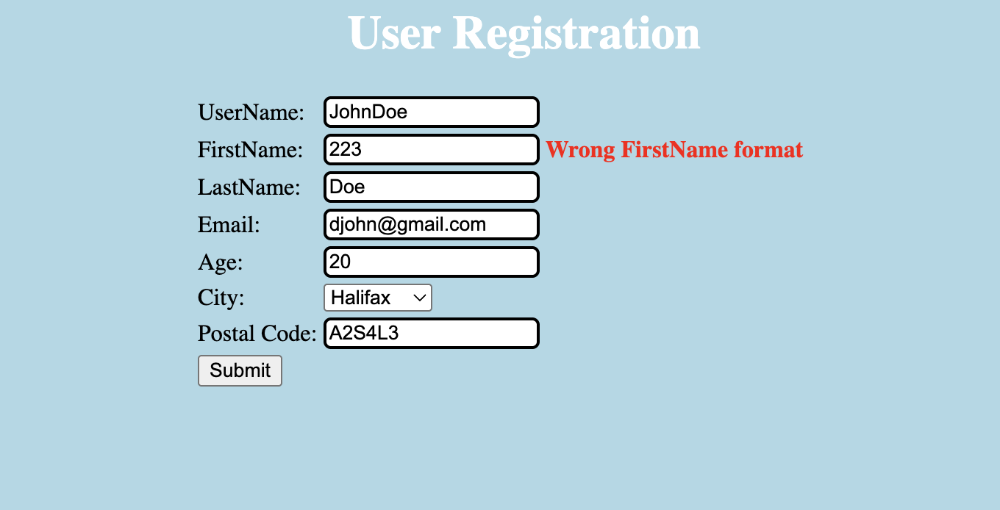 | Success |
| 5 | Wrong LastName format | LastName has a special character (@) => Wrong LastName format error message is displayed. 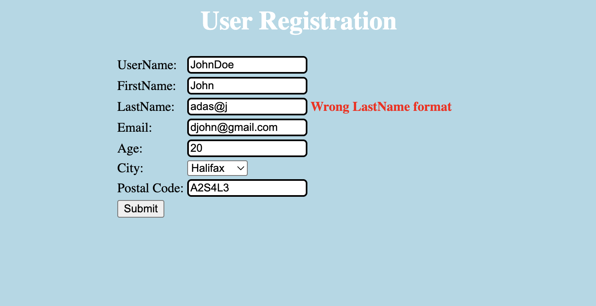 | Success |
| 6 | Wrong Email format | Email does not contain @ => Wrong Email format error message is displayed. 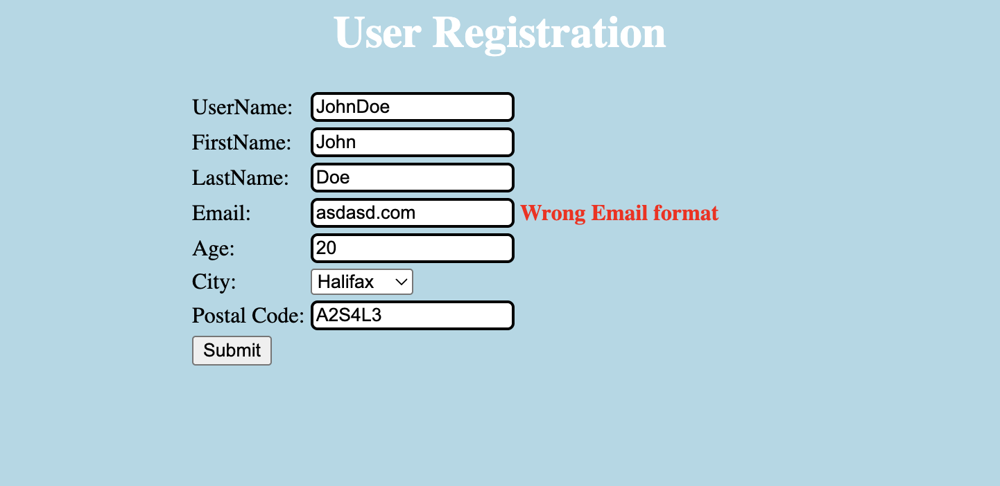 | Success |
| 7 | Age must be less than or equal to 64 | Age = 1000000 => Age must be less than or equal to 64 error message is displayed. 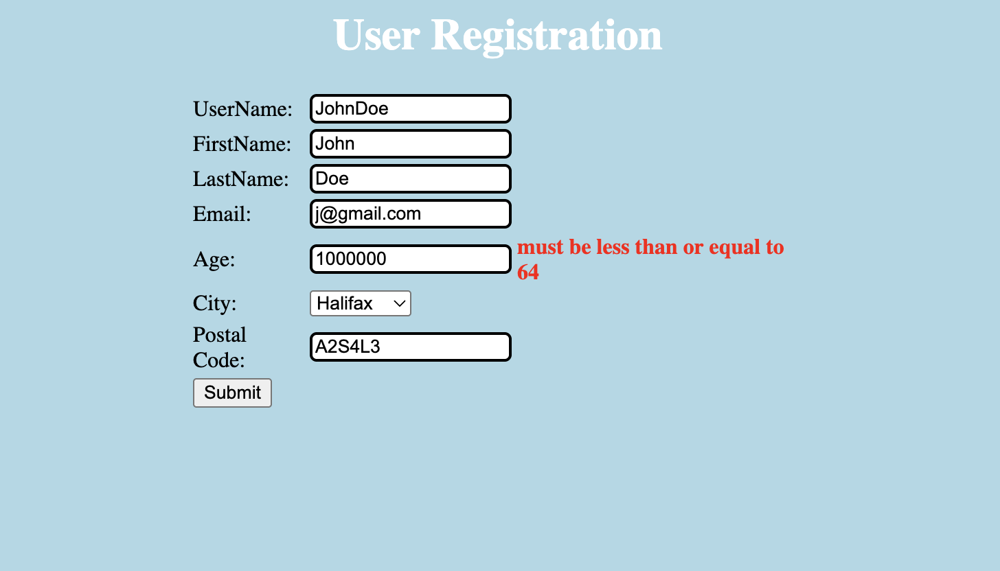 | Success |
| 8 | Age must be greater than or equal to 18 | Age = -111 => Age must be greater than or equal to 18 error message is displayed. 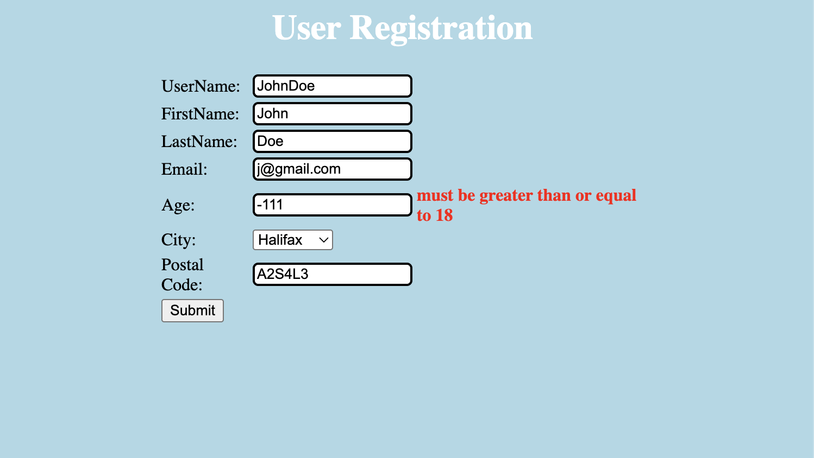 | Success |
| 9 | Age must be an integer | Age is a string => Failed to convert property value of type java.lang.String to required type java.lang.Integer for property age; nested exception is java.lang.NumberFormatException: For input string: "aaa". 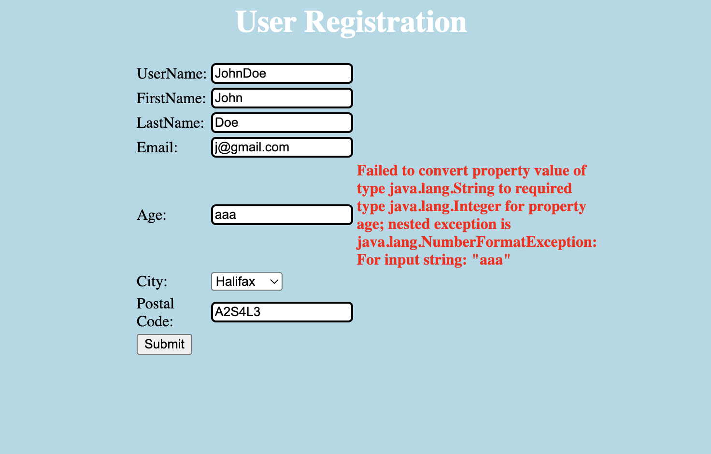 | Success |
| 10 | Wrong Postal Code format | Postal Code does not follow the format A1A1A1 => Wrong Postal Code format error message is displayed. 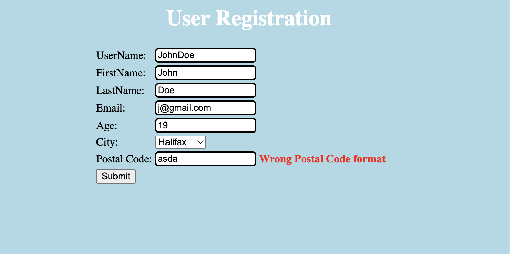 | Success |

## Exercice 2
### Execution of the provided tests

First, I executed the tests provided in the project ecs to ensure that the tests can compile and execute successfully.

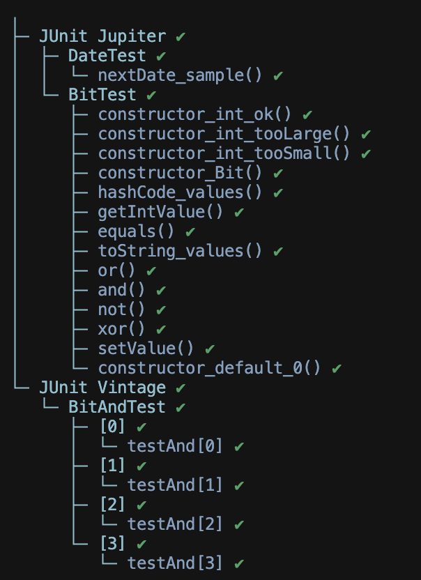

### Tests implementation

I implemented the 20 test cases provided at [`./ecs/test/DateTest.java`](./ecs/test/DateTest.java) .

The first 15 cases verify that the nextDate method returns the correct next day.  
The last 5 cases verify that invalid dates produce an IllegalArgumentException.

I then implemented the parameterized tests for valid dates at [`./ecs/test/DateNextDateOkTest.java`](./ecs/test/DateNextDateOkTest.java) . 

And the parameterized tests for exceptions at [`./ecs/test/DateNextDateExceptionTest.java`](./ecs/test/DateNextDateExceptionTest.java) .

These tests are executed successfully.

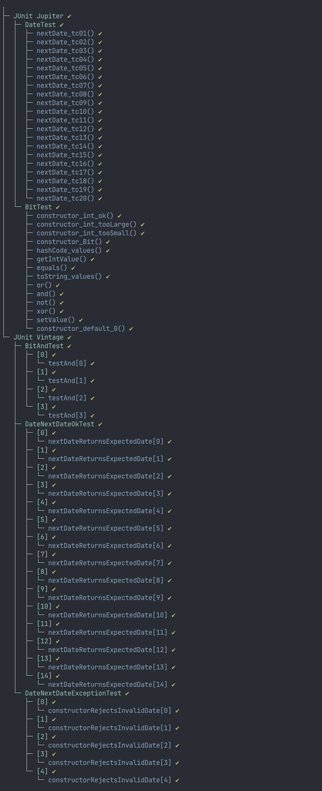