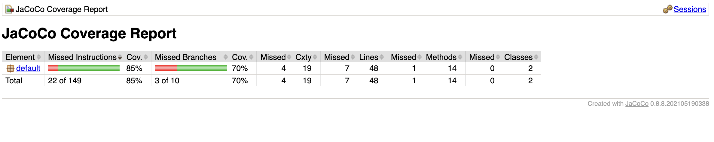
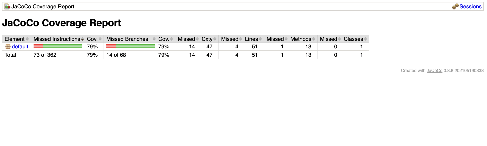
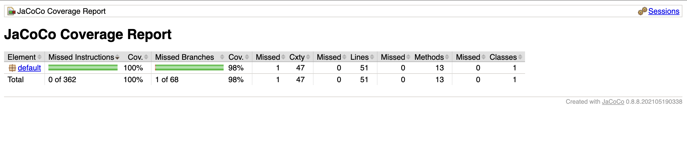

# SEG3503 Lab 03

| Outline | Value |
| --- | --- |
| Course | SEG 3503 |
| Date | Summer 2026 |
| Name | Mai Anh Hoang |
| Professor | Dr. Mouhcine Guennoun |
| TA | Mohamed Nefsi |

# Computation

# Date
## Coverage before refactoring

## Coverage after refactoring

