# SEG3503 Lab 04

| Outline | Value |
| --- | --- |
| Course | SEG 3503 |
| Date | Summer 2026 |
| Name | Mai Anh Hoang |
| Professor | Dr. Mouhcine Guennoun |
| TA | Mohamed Nefsi |

## Exercice 1: Execution of the provided tests

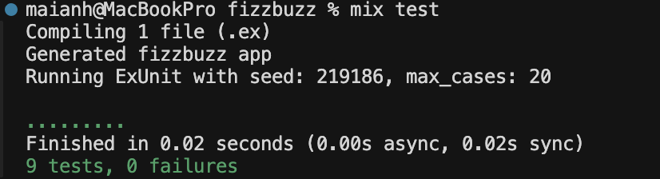
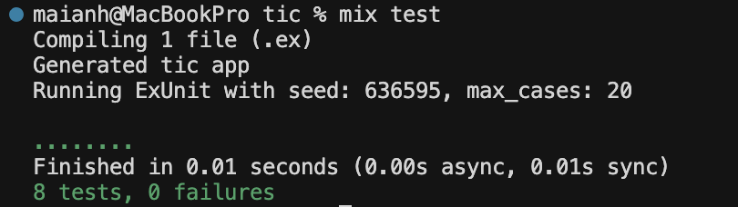

## Exercice 2: 5 commits group

|Commit group|Commit numbers|Descriptions|
|-|-|-|
|1|082f615, 9c7babc|Created a failing test for two new boards with the same size to be equal, then implemented equality for `Tic` boards. 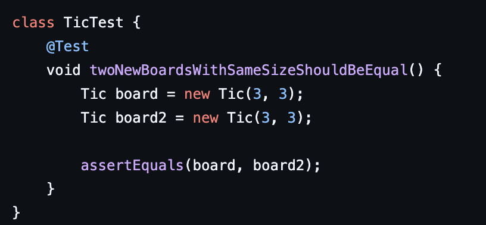 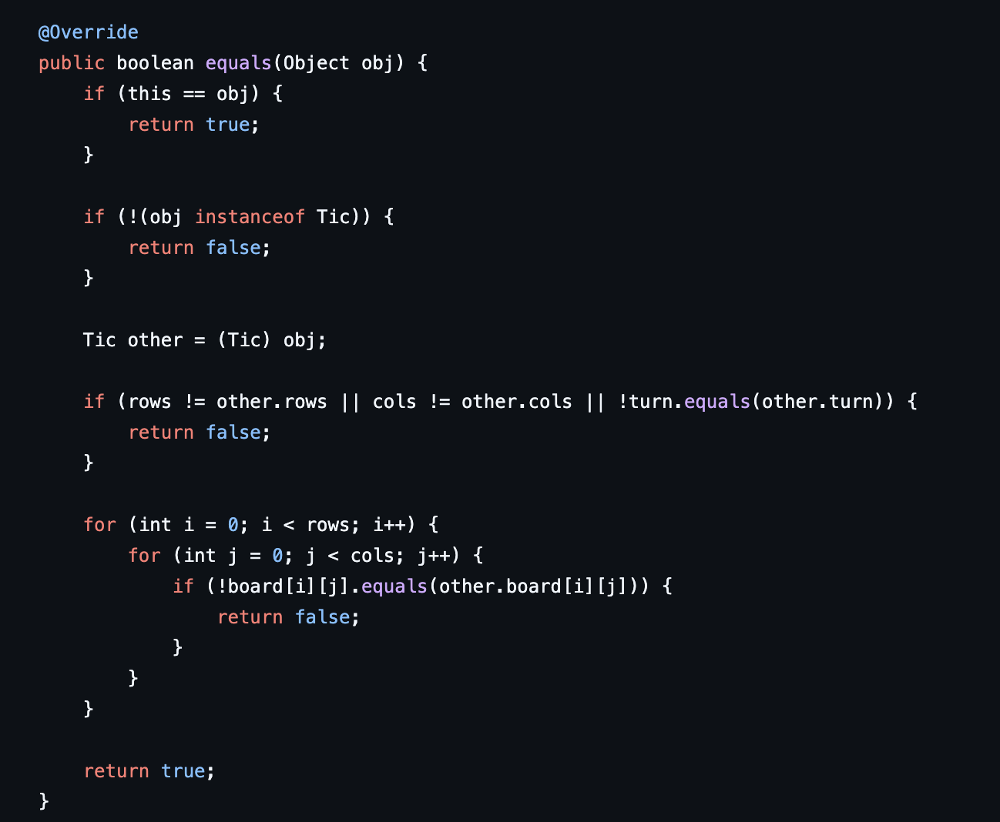|
|2|9f79975, 67b6e80, dda7a07|Created a failing test for the first move placing `X`, implemented `play`, then refactored the test to check only the selected cell changes. 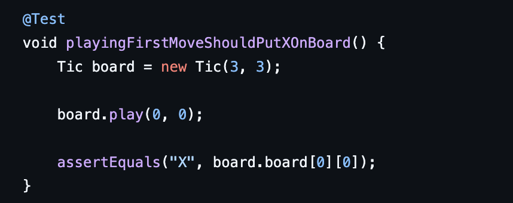 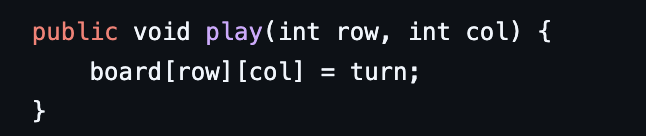 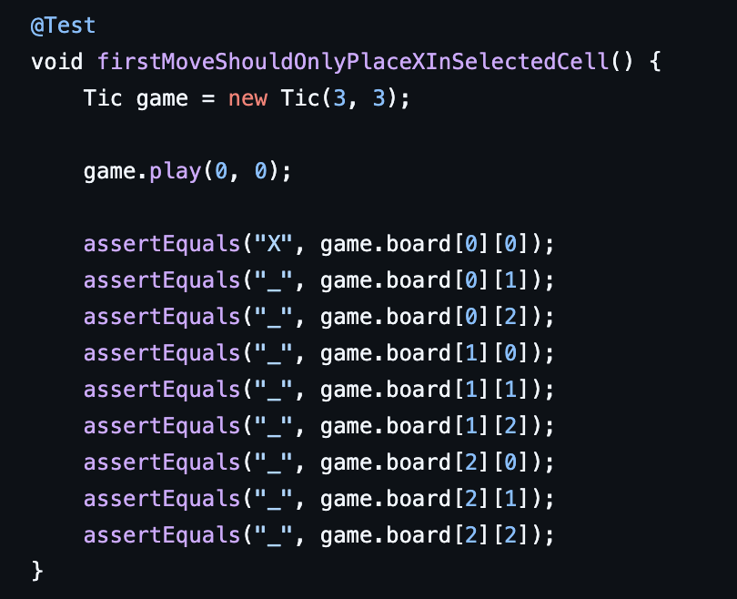|
|3|763aac3, b72c5ec|Created a failing test for the first move changing the turn to `O`, then updated the game to switch turns after a move. 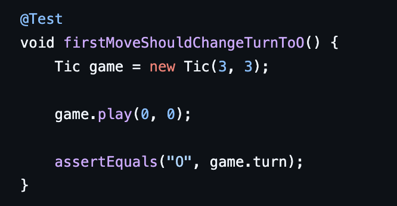 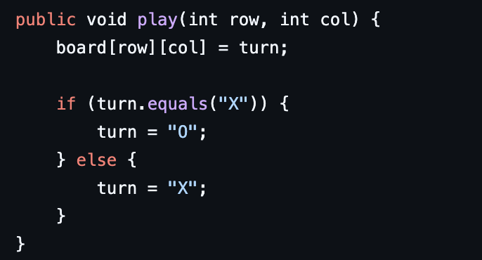|
|4|42459f6, f800b99|Created a failing test to prevent overwriting an occupied cell, then updated `play` to ignore moves on used cells. 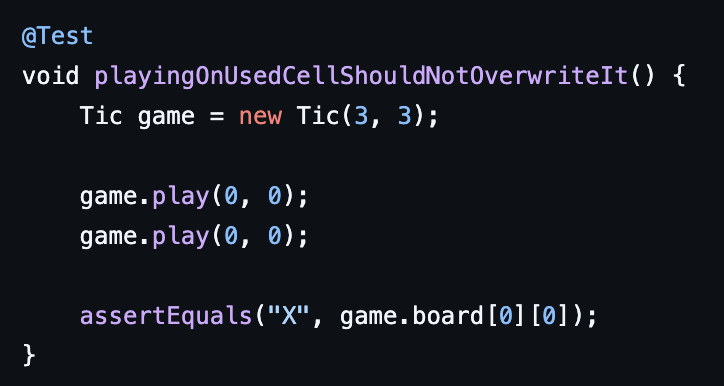 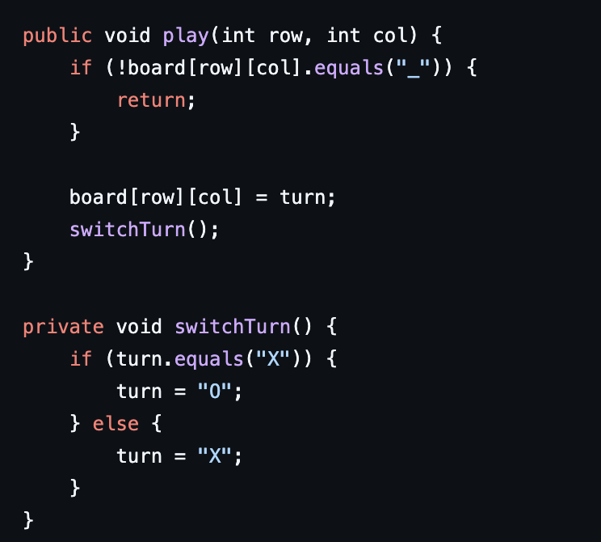|
|5|b073fa6, 82229ef|Created a failing test for reading the board dimensions, then added `getRows` and `getCols`. 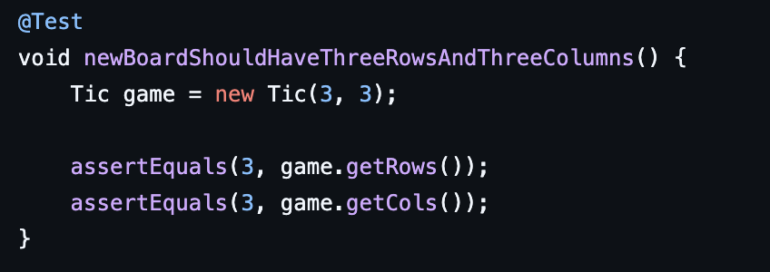 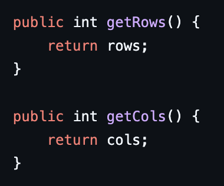|
