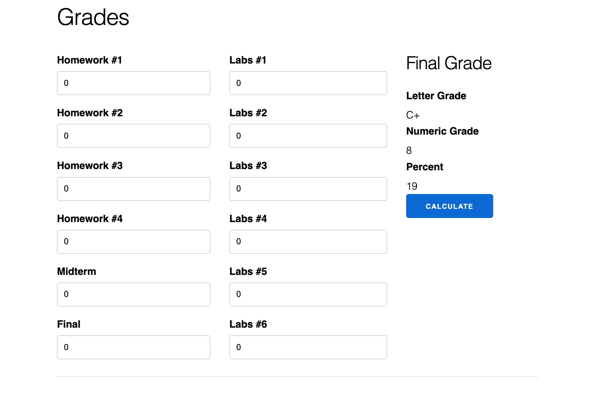
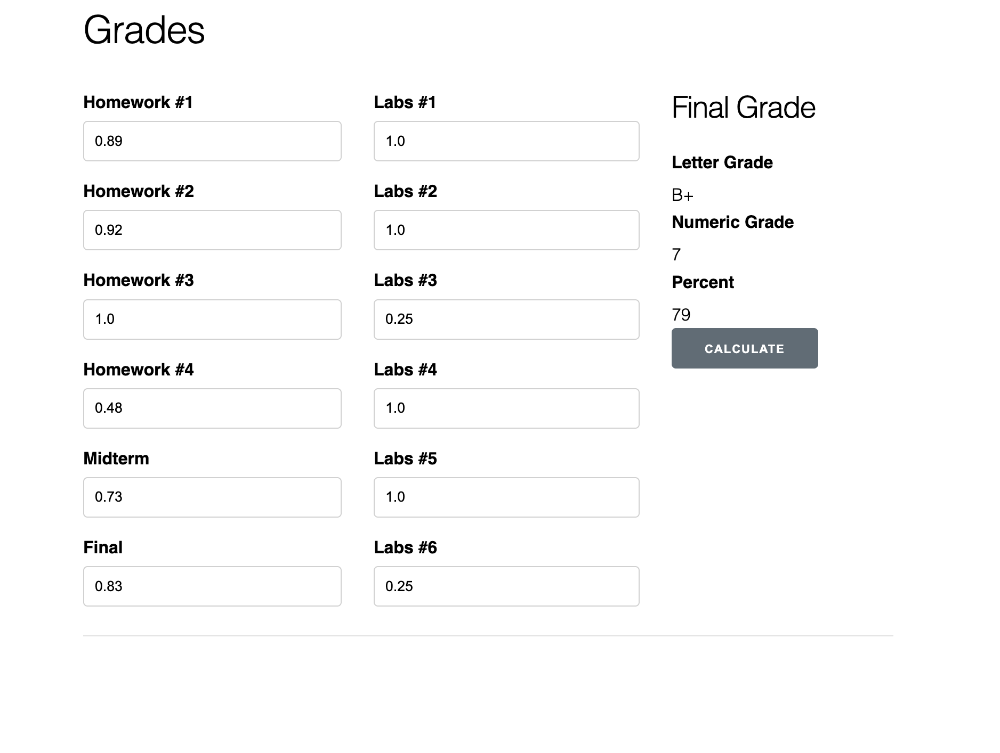
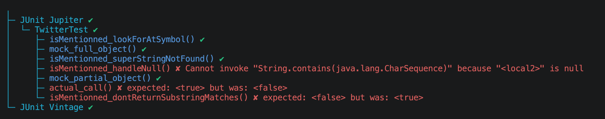
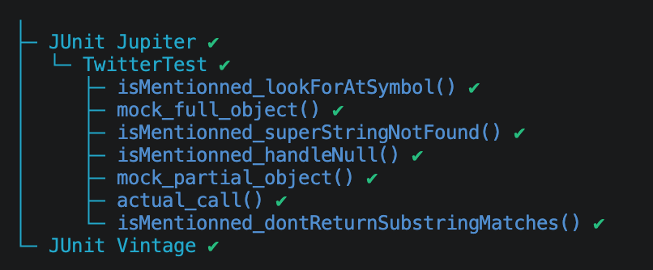

# SEG3503 Lab 05

| Outline   | Value                 |
| --------- | --------------------- |
| Course    | SEG 3503              |
| Date      | Summer 2026           |
| Name      | Mai Anh Hoang         |
| Professor | Dr. Mouhcine Guennoun |
| TA        | Mohamed Nefsi         |

## Grades

### Stubbed Code:

```
defmodule Grades.Calculator do
  def percentage_grade(%{homework: homework, labs: labs, midterm: midterm, final: final}) do
    Enum.random(0..100)
  end

  def letter_grade(%{homework: homework, labs: labs, midterm: midterm, final: final}) do
    arr = ["EIN", "F", "E", "D", "D+", "C", "C+", "B", "B+", "A-", "A", "A+"]
    Enum.random(arr)
  end

  def numeric_grade(%{homework: homework, labs: labs, midterm: midterm, final: final}) do
    Enum.random(0..10)
  end

end
```

### Stubbed code output



### Working implementation

Since there's no code for assignment 2, for this part I implemented the code to make the application works as expected

```
defmodule Grades.Calculator do

  def avg(marks) do
    if Enum.count(marks) == 0 do
        0
    else
      Enum.sum(marks) / Enum.count(marks)
    end
  end

  def failure_to_participate(avg_homework, avg_exams, num_labs) do
    avg_homework < 0.4 || avg_exams < 0.4 || num_labs < 3
  end

  def calculate_grade(avg_labs, avg_homework, midterm, final) do
    0.2 * avg_labs + 0.3 * avg_homework + 0.2 * midterm + 0.3 * final
  end

  def avg_exams(midterm,final) do
    (midterm+final)/2
  end

  def num_labs(labs) do
    labs
        |> Enum.reject(fn mark -> mark < 0.25 end)
        |> Enum.count()
  end

  def percentage_grade(%{homework: homework, labs: labs, midterm: midterm, final: final}) do
    avg_homework = avg(homework)
    avg_labs = avg(labs)

    mark = calculate_grade(avg_labs, avg_homework, midterm, final)
    round(mark * 100)
  end

  def letter_grade(%{homework: homework, labs: labs, midterm: midterm, final: final}) do
    avg_homework = avg(homework)
    avg_labs = avg(labs)

    avg_exams = avg_exams(midterm,final)

    num_labs = num_labs(labs)

    if failure_to_participate(avg_homework, avg_exams, num_labs) do
      "EIN"
    else
      mark = calculate_grade(avg_labs, avg_homework, midterm, final)

      cond do
        mark > 0.895 -> "A+"
        mark > 0.845 -> "A"
        mark > 0.795 -> "A-"
        mark > 0.745 -> "B+"
        mark > 0.695 -> "B"
        mark > 0.645 -> "C+"
        mark > 0.595 -> "C"
        mark > 0.545 -> "D+"
        mark > 0.495 -> "D"
        mark > 0.395 -> "E"
        :else -> "F"
      end
    end
  end

  def numeric_grade(%{homework: homework, labs: labs, midterm: midterm, final: final}) do
    avg_homework = avg(homework)
    avg_labs = avg(labs)

    avg_exams = avg_exams(midterm,final)

    num_labs = num_labs(labs)

    if failure_to_participate(avg_homework, avg_exams, num_labs) do
      0
    else
      mark = calculate_grade(avg_labs, avg_homework, midterm, final)

      cond do
        mark > 0.895 -> 10
        mark > 0.845 -> 9
        mark > 0.795 -> 8
        mark > 0.745 -> 7
        mark > 0.695 -> 6
        mark > 0.645 -> 5
        mark > 0.595 -> 4
        mark > 0.545 -> 3
        mark > 0.495 -> 2
        mark > 0.395 -> 1
        :else -> 0
      end
    end
  end
end
```

### Working implementation output



## Twitter

### Missing tests case implementation

```
   @Test
    void isMentionned_lookForAtSymbol() {
        // Assuming a tweet like "hello @me"
        // isMentionned("me") should be true
        // isMentionned("you") should be false

        Twitter twitter = partialMockBuilder(Twitter.class)
                .addMockedMethod("loadTweet")
                .createMock();

        expect(twitter.loadTweet()).andReturn("hello @me").times(2);
        replay(twitter);

        boolean actual;

        actual = twitter.isMentionned("me");
        assertEquals(true, actual);

        actual = twitter.isMentionned("you");
        assertEquals(false, actual);

    }

    @Test
    void isMentionned_dontReturnSubstringMatches() {
        // Assuming a tweet like "hello @meat"
        // isMentionned("me") should be false
        // isMentionned("meat") should be true

        Twitter twitter = partialMockBuilder(Twitter.class)
                .addMockedMethod("loadTweet")
                .createMock();

        expect(twitter.loadTweet()).andReturn("hello @meat").times(2);
        replay(twitter);

        boolean actual;

        actual = twitter.isMentionned("meat");
        assertEquals(true, actual);

        actual = twitter.isMentionned("me");
        assertEquals(false, actual);

    }

    @Test
    void isMentionned_superStringNotFound() {
        // Assuming a tweet like "hello @me"
        // isMentionned("me") should be true
        // isMentionned("meat") should be false
        Twitter twitter = partialMockBuilder(Twitter.class)
                .addMockedMethod("loadTweet")
                .createMock();

        expect(twitter.loadTweet()).andReturn("hello @me").times(2);
        replay(twitter);

        boolean actual;

        actual = twitter.isMentionned("me");
        assertEquals(true, actual);

        actual = twitter.isMentionned("meat");
        assertEquals(false, actual);
    }

    @Test
    void isMentionned_handleNull() {
        // Assuming no tweet is available (i.e. null)
        // isMentionned("me") should be false
        // isMentionned("meat") should be false
        Twitter twitter = partialMockBuilder(Twitter.class)
                .addMockedMethod("loadTweet")
                .createMock();

        expect(twitter.loadTweet()).andReturn(null).times(2);
        replay(twitter);

        boolean actual;

        actual = twitter.isMentionned("me");
        assertEquals(false, actual);

        actual = twitter.isMentionned("meat");
        assertEquals(false, actual);
    }
```

### Tests results



### Results analysis

The two `isMentionned` tests failed because the original implementation had two bugs:

1. **Null tweet bug**  
   If `loadTweet()` returned `null`, then `tweet.contains(...)` crashed with a `NullPointerException`.  
   So the “handle null” test expected `false`, but the method crashed instead.

2. **Substring match bug**  
   For a tweet like `"hello @meat"`, checking `contains("@me")` returns `true` because `@me` is inside `@meat`.  
   But `@meat` is a mention of `meat`, not `me`, so `isMentionned("me")` should return `false`.

The fix checks for `null` first, then uses a regex boundary so `@me` only matches as a complete mention, not as part of a longer word.

### isMentionned after fix

```
  public boolean isMentionned(String name) {
    String tweet = loadTweet();
    if (tweet == null || name == null) {
      return false;
    }

    return Pattern.compile("(?<!\\w)@" + Pattern.quote(name) + "(?!\\w)")
      .matcher(tweet)
      .find();
  }
```

### Tests results after fix

