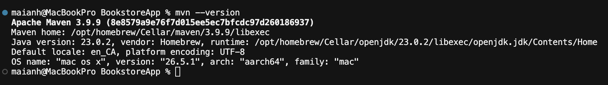
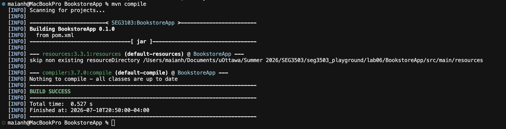
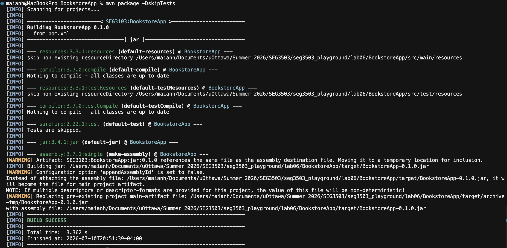
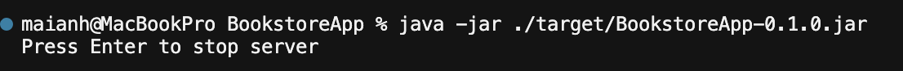
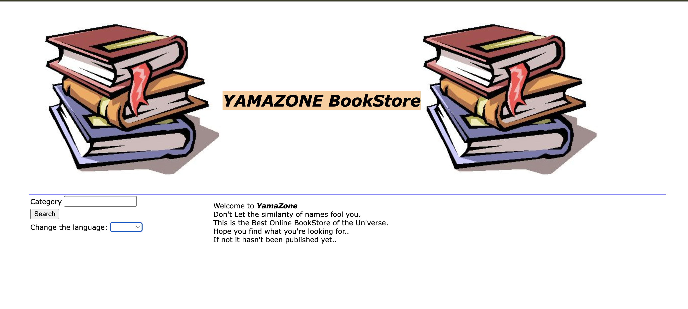
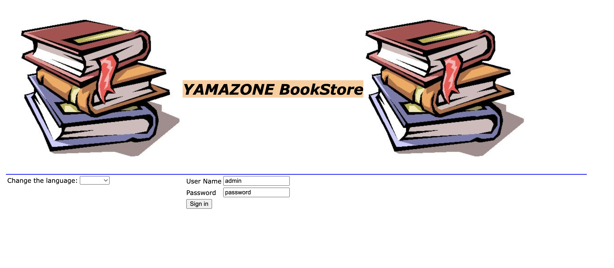
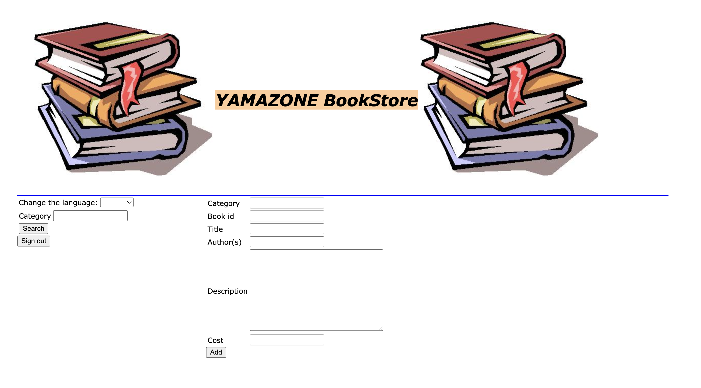
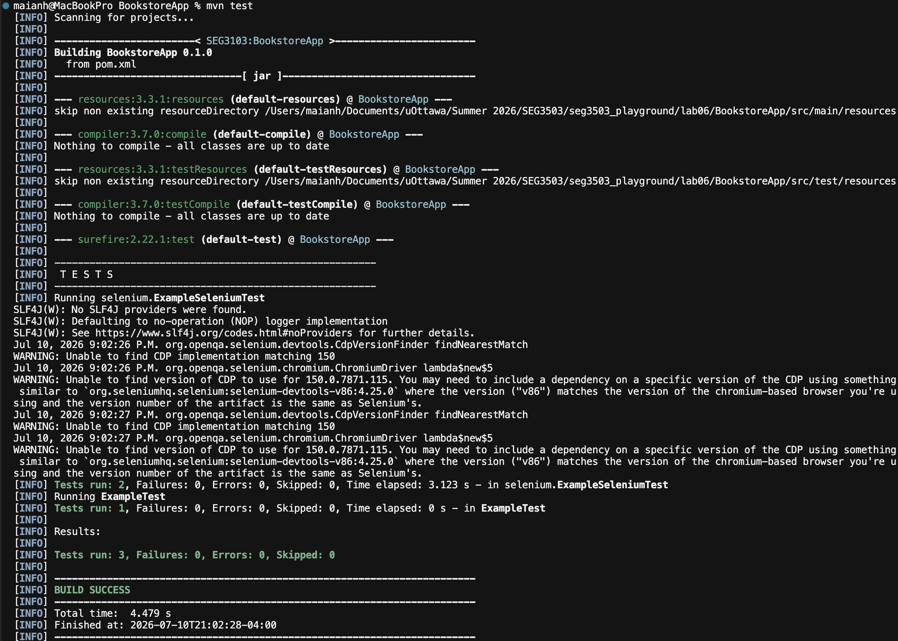
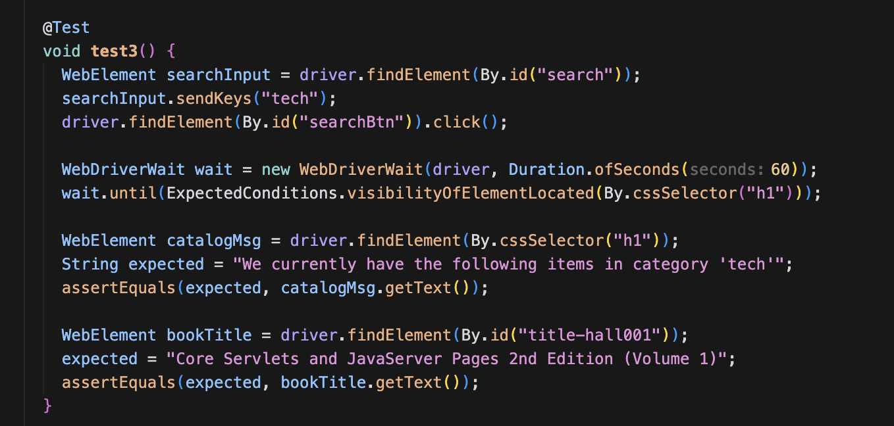
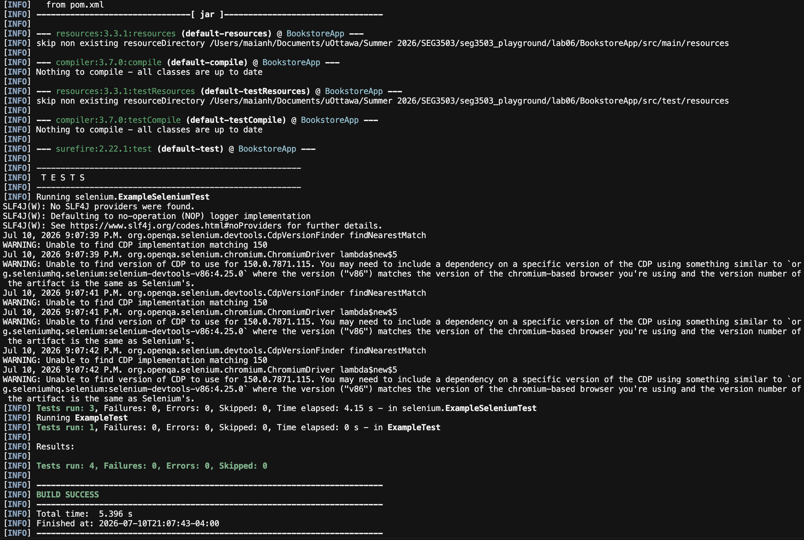

# SEG3503 Lab 06

| Outline   | Value                 |
| --------- | --------------------- |
| Course    | SEG 3503              |
| Date      | Summer 2026           |
| Name      | Mai Anh Hoang         |
| Professor | Dr. Mouhcine Guennoun |
| TA        | Mohamed Nefsi         |

output of `mvn --version`

output of `mvn compile`

output of `mvn package -DskipTests`

## Running the application
output of `java -jar ./target/BookstoreApp-0.1.0.jar`

Application running on http://localhost:8080/

Application running on http://localhost:8080/admin

Log into admin page

## Running the tests
output of `mvn test`

adding one addtional selenium webdriver test

output of `mvn test` after adding one addtional selenium webdriver test
